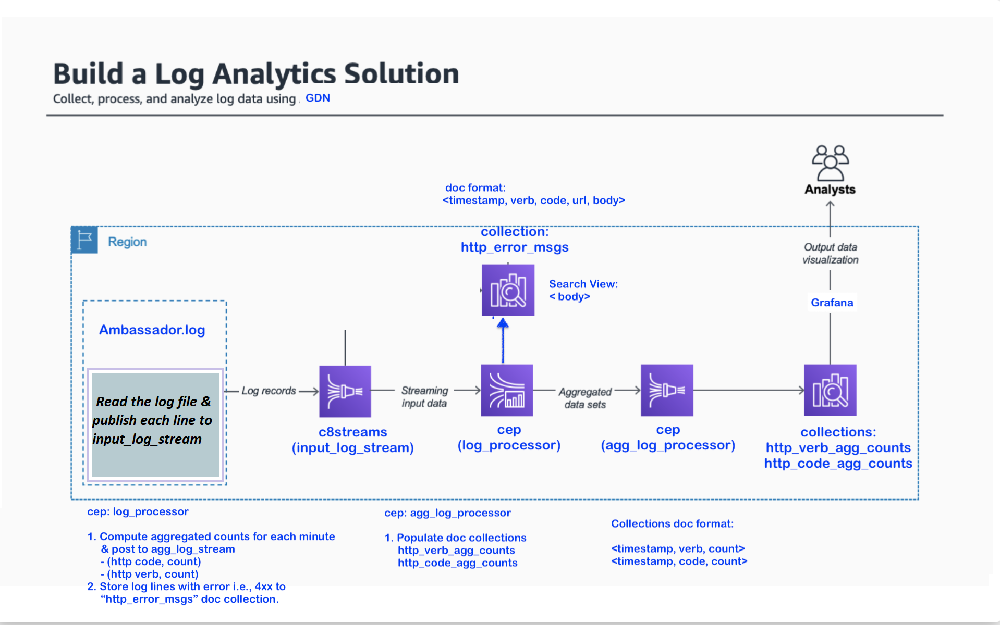

# tutorial-log-analytics
Building real-time log analytics solution using GDN



### Setup

| **Federation** | **Email** | **Passsword** |
|------------|----------|--------------|
| [Global Data Network](https://gdn.paas.macrometa.io/) | xxxxxx | `xxxxxxxx`| 

### Log Producer

**Build:**
TBD

**How to Run:**
git clone https://github.com/Macrometacorp/tutorial-log-analytics.git
cd tutorial-log-analytics
npm install
node app.js

### Stream Workers

**log_processor:**
```
@App:name("log_processor")
@App:description("Process error logs")

-- Read the incoming log and extract verb, code, url, timestamp
define function parseLog[javascript] return string {

    var log = data[0];
    var key = data[1];
    const regex = /"[^"]+"|[^\s]+/g;
    const splittedLine = log.match(regex).map(e => e.replace(/"(.+)"/, "$1"));
    let [ipAddress, , , dateStr, seconds, headers, httpCode, ...remaining] = splittedLine;
    const [httpVerb, url] = headers.split(" ");
    
    // -- Round of the seconds  Ex. 11/Feb/2020:13:55:23 +0100 to 11/Feb/2020:13:55:00
    const timeStamp = dateStr.slice(1,-1).substr(0, dateStr.length-4)+":00";
    
    let response;
    
    if(key=='verb'){
       response = httpVerb.trim();
    }else if(key=='code'){
       response = httpCode;
    }else if(key=='url'){
       response = url;
    }else if(key=='timestamp'){
       response = timeStamp;
    }
    
    return response;
};


@info("Read logs from input_log_stream stream")
@source(type="c8streams", stream.list="input_log_stream", replication.type="local", @map(type='json'))
define stream input_log_stream(log string);

@info("Store the error logs in http_error_msgs table")
@store(type="c8db", collection="http_error_msgs", replication.type="local", @map(type='json'))
define table http_error_msgs(timestamp string, verb string, code int, url string);

@info("Publish the log data on http_intermediate_agg_counts for further processing")
@sink(type='c8streams', stream='http_intermediate_agg_counts', replication.type="local", @map(type='json'))
define stream http_intermediate_agg_counts(timestamp string, verb string, code int, url string);


@info("Store the error logs into http_error_msgs collection")
SELECT
    parseLog(log, "timestamp") as timestamp,
    parseLog(log, 'verb') as verb,
    convert(parseLog(log, 'code'), 'int') as code,
    parseLog(log, 'url') as url
FROM input_log_stream[
    (convert(parseLog(log,'code'), 'int') >= 400) 
    and (convert(parseLog(log, 'code'), 'int') <= 599)
    and false==str:equalsIgnoreCase(parseLog(log, 'verb'), "EOF")
]
INSERT into http_error_msgs;


@info("Publish the log data on http_intermediate_agg_counts stream for further processing")
SELECT
    parseLog(log, 'timestamp') as timestamp,
    parseLog(log, 'verb') as verb,
    convert(parseLog(log, 'code'), 'int') as code,
    parseLog(log, 'url') as url
FROM input_log_stream
INSERT into http_intermediate_agg_counts;

```

**agg_code_processor:**
```
@App:name("agg_code_processor")
@App:description("Process aggregated code counts")


-- Populate and update the code-counter map. Increment counter value for the current verb
define function updateCache[javascript] return string {
    var verb = data[0].toString();
    var cachedValue = data[1];
    let map = JSON.parse(cachedValue);
    typeof map[verb] == 'undefined' ? map[verb] = 1 : map[verb]++;

    return JSON.stringify(map);
};


-- Convert the record into JSON object
define function toJson[javascript] return object {
    const cache = data[0];
    return  JSON.parse(data[0]);
};


-- Collection does not support key having special caracter like / and :
-- Replace such characters with _ (underscore)
define function getKey[javascript] return string {
    return  data[0].replace(/\//g,"_").replace(/:/g,"_");
};


@store(type='c8db', collection='http_code_agg_counts', replication.type="local", @map(type='json'))
define table http_code_agg_counts(timestamp string, map object);

@source(type='c8streams', stream.list='http_intermediate_agg_counts', replication.type="local", @map(type='json'))
define stream http_intermediate_agg_counts(timestamp string, verb string, code int, url string);

@store(type='c8db', collection='put_in_cache', replication.type="local", @map(type='json'))
define table put_in_cache(isVerbPut bool, isTimestampPut bool, oldData bool);


-- Maintain timestamp from the log in the cache
select
    ifThenElse(cache:get(getKey(timestamp), "") == "", 
        cache:put(getKey(timestamp),updateCache(code, "{}")), 
        cache:put(getKey(timestamp),updateCache(code, cache:get(getKey(timestamp))))
    ) as isVerbPut,
    false as isTimestampPut,
    false as oldData
    from http_intermediate_agg_counts
insert into put_in_cache;


-- When a log with new minute arrives
-- Get the old timestamp value 
-- And the previously aggregated cached data for that timestamp 
-- Insert that into the collection.
-- Skip insert if previously aggregated cached data is not available. i.e., 1st log from the file
select
    cache:get("old_timestamp", "") as timestamp,
    toJson(cache:get("old_timestamp_data", "")) as map
    from http_intermediate_agg_counts[
        false==str:equalsIgnoreCase(getKey(cache:get("old_timestamp_key", "")), getKey(timestamp))
        and false==str:equalsIgnoreCase(cache:get("old_timestamp_data", "") ,"")
    ]
INSERT into http_code_agg_counts;


-- Update the cache with
-- old_timestamp_key    Ex. `11_Feb_2020_13_56_00`
-- old_timestamp        Ex. `11/Feb/2020:13:56:00`
-- old_timestamp_data   Ex.  `{'map': { '200': 3, '400': 1, '401': 1, '505': 1 }}`
select
    cache:put("old_timestamp_key", getKey(timestamp)) as isVerbPut,
    cache:put("old_timestamp", timestamp) as isTimestampPut,
    cache:put("old_timestamp_data", cache:get(getKey(timestamp))) as oldData
    from http_intermediate_agg_counts[
        false==str:equalsIgnoreCase(verb, "EOF")
    ]
insert into put_in_cache;


-- Once file has been processed, it is required to purge the cache
-- The JS client app will send a dummy log with `EOF` text in the verb field
select
    cache:purge() as isVerbPut,
    false as isTimestampPut,
    false as oldData
    from http_intermediate_agg_counts[
        str:equalsIgnoreCase(verb, "EOF")
    ]
insert into put_in_cache;
```


**agg_verb_processor:**
```
@App:name("agg_verb_processor")
@App:description("Process aggregated verb counts")


-- Populate and update the verb-counter map. Increment counter value for the current verb
define function updateCache[javascript] return string {
    var verb = data[0].toString();
    var cachedValue = data[1];
    let map = JSON.parse(cachedValue);
    typeof map[verb] == 'undefined' ? map[verb] = 1 : map[verb]++;

    return JSON.stringify(map);
};


-- Convert the record into JSON object
define function toJson[javascript] return object {
    const cache = data[0];
    return  JSON.parse(data[0]);
};


-- Collection does not support key having special caracter like / and :
-- Replace such characters with _ (underscore)
define function getKey[javascript] return string {
    return  data[0].replace(/\//g,"_").replace(/:/g,"_");
};


@store(type='c8db', collection='http_verb_agg_counts', replication.type="local", @map(type='json'))
define table http_verb_agg_counts(timestamp string, map object);

@source(type='c8streams', stream.list='http_intermediate_agg_counts', replication.type="local", @map(type='json'))
define stream http_intermediate_agg_counts(timestamp string, verb string, code int, url string);

@store(type='c8db', collection='put_in_cache', replication.type="local", @map(type='json'))
define table put_in_cache(isVerbPut bool, isTimestampPut bool, oldData bool);


-- Maintain timestamp from the log in the cache
select
    ifThenElse(cache:get(getKey(timestamp), "") == "", 
        cache:put(getKey(timestamp),updateCache(verb, "{}")), 
        cache:put(getKey(timestamp),updateCache(verb, cache:get(getKey(timestamp))))
    ) as isVerbPut,
    false as isTimestampPut,
    false as oldData
    from http_intermediate_agg_counts
insert into put_in_cache;


-- When a log with new minute arrives
-- Get the old timestamp value 
-- And the previously aggregated cached data for that timestamp 
-- Insert that into the collection.
-- Skip insert if previously aggregated cached data is not available. i.e., 1st log from the file
select
    cache:get("old_timestamp", "") as timestamp,
    toJson(cache:get("old_timestamp_data", "")) as map
    from http_intermediate_agg_counts[
        false==str:equalsIgnoreCase(getKey(cache:get("old_timestamp_key", "")), getKey(timestamp))
        and false==str:equalsIgnoreCase(cache:get("old_timestamp_data", "") ,"")
    ]
INSERT into http_verb_agg_counts;


-- Update the cache with
-- old_timestamp_key    Ex. `11_Feb_2020_13_56_00`
-- old_timestamp        Ex. `11/Feb/2020:13:56:00`
-- old_timestamp_data   Ex.  `{'map': { '200': 3, '400': 1, '401': 1, '505': 1 }}`
select
    cache:put("old_timestamp_key", getKey(timestamp)) as isVerbPut,
    cache:put("old_timestamp", timestamp) as isTimestampPut,
    cache:put("old_timestamp_data", cache:get(getKey(timestamp))) as oldData
    from http_intermediate_agg_counts[
        false==str:equalsIgnoreCase(verb, "EOF")
    ]
insert into put_in_cache;


-- Once file has been processed, it is required to purge the cache
-- The JS client app will send a dummy log with `EOF` text in the verb field
select
    cache:purge() as isVerbPut,
    false as isTimestampPut,
    false as oldData
    from http_intermediate_agg_counts[
        str:equalsIgnoreCase(verb, "EOF")
    ]
insert into put_in_cache;
```


### Collections

- http_verb_agg_count (doc collection)
- http_code_agg_count (doc collection)
- http_error_msgs (doc collection)

### Indexes

TBD

### Search

TBD

### Visualization

TBD

