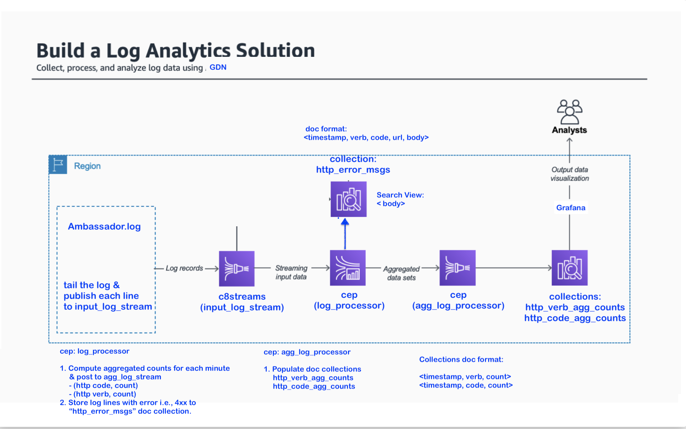

# tutorial-log-analytics
Building real-time log analytics solution using GDN



### Setup

| **Federation** | **Email** | **Passsword** |
|------------|----------|--------------|
| [Global Data Network](https://gdn.paas.macrometa.io/) | xxxxxx | `xxxxxxxx`| 

### Log Producer

**Build:**
TBD

**How to Run:**
TBD

### Stream Workers

**log_processor:**
```

```

**agg_log_processor:**
```

```

### Collections

- http_verb_agg_count (doc collection)
- http_code_agg_count (doc collection)
- http_error_msgs (doc collection)

### Indexes

TBD

### Search

TBD

### Visualization

TBD

